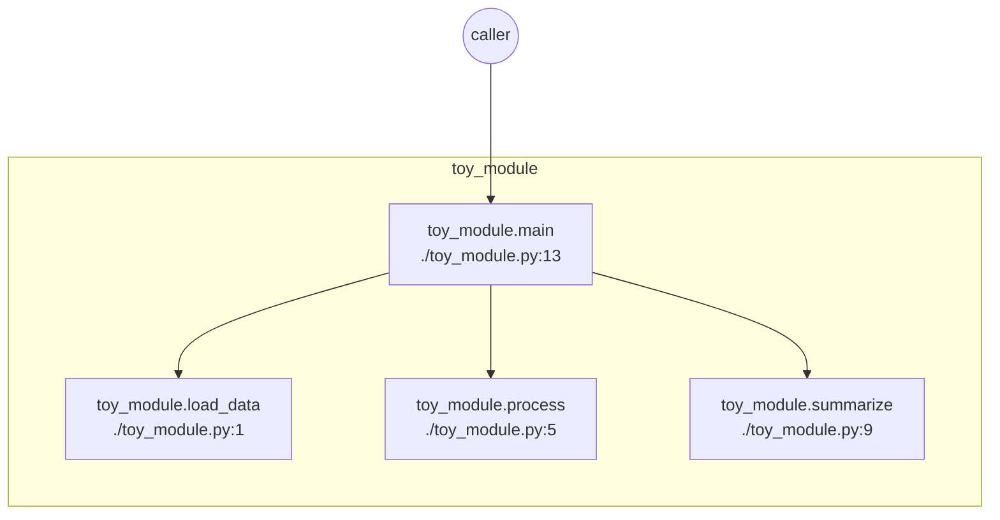
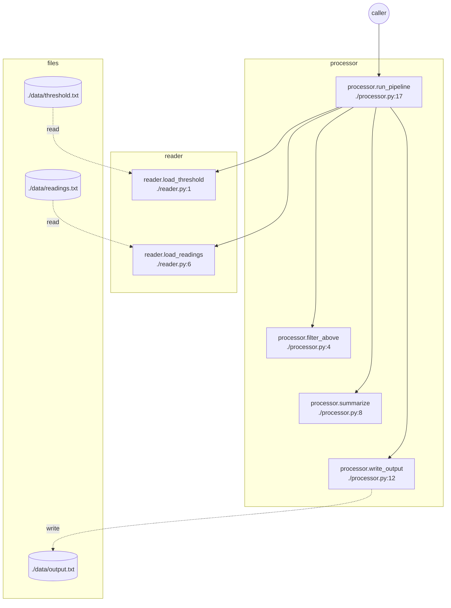
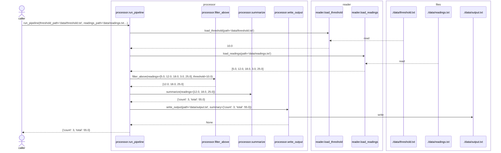
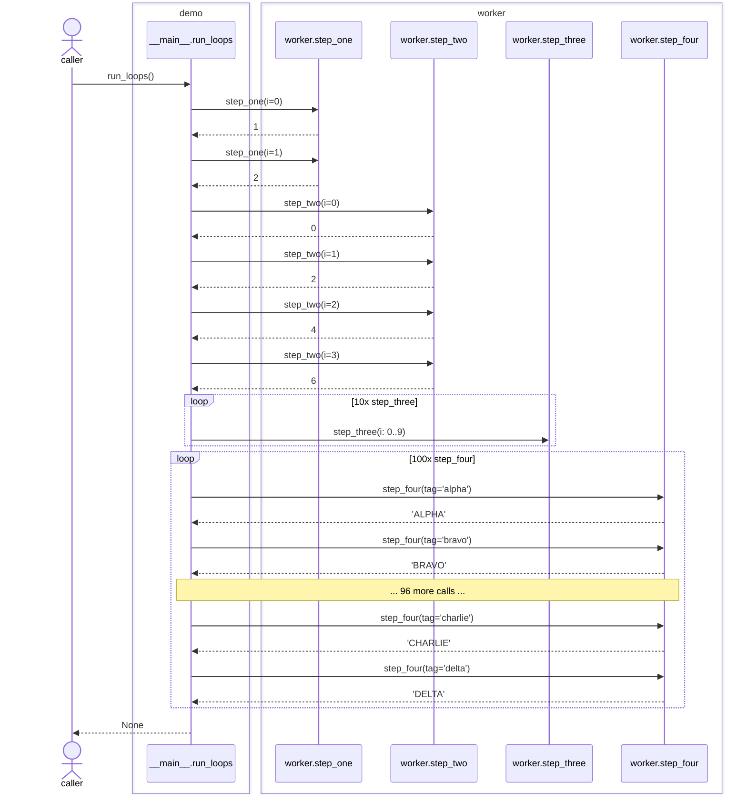
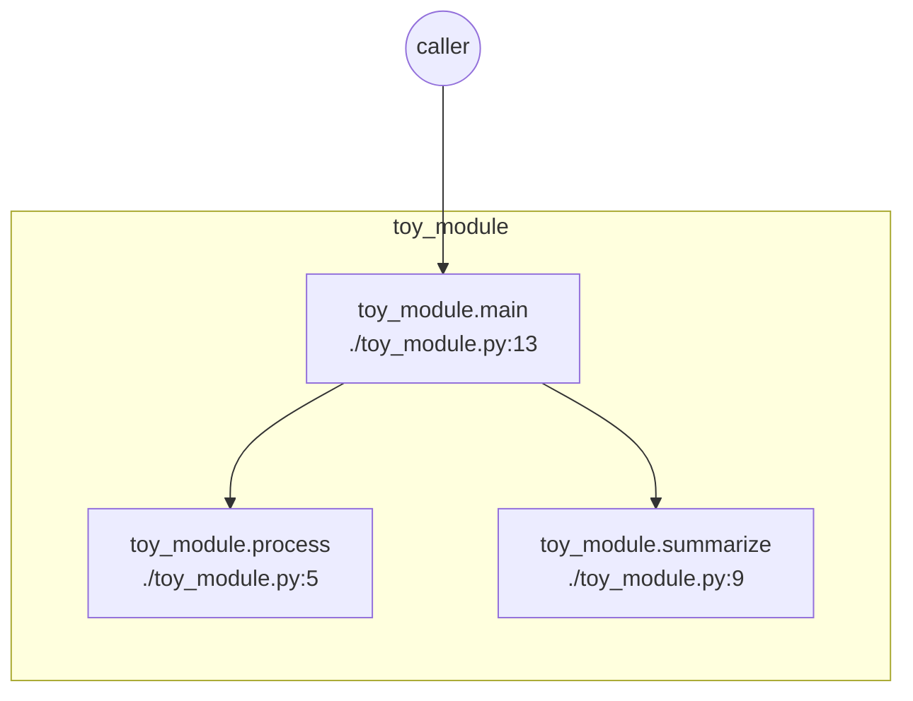

# exec_tracer

Traces a real run of Python code and turns it into a Mermaid diagram: the
actual call graph, in the actual order things executed. No more hand-drawn
architecture diagrams that go stale the moment the code changes.

It works by attaching to `sys.setprofile` for the duration of a `with`
block and detaching afterward, so there's nothing to decorate and nothing
about the traced code has to change. It's a single file, pure standard
library, nothing to install. Copy `exec_tracer.py` into your project,
point `root` at your source folder, and you're done.

## Quickstart

```python
from exec_tracer import trace

with trace(root="path/to/your/source") as run:
    your_function(...)   # whatever you want to observe

run.show()           # renders inline (Jupyter/VS Code, no CDN or server)
run.save("trace.md")  # or write it to a file
```

You can also just run `python examples/simple/demo.py` to see it work
against a small bundled example, then edit that file to point at your own
project. `examples/pipeline/demo.py` is a second example, showing what a
trace looks like once multiple modules and real file I/O are involved.

One thing that trips people up: only code that lives in a real `.py` file
gets traced. Root scoping works by matching each function's on-disk file
path, and code typed directly into a notebook cell doesn't have one, so it
stays invisible no matter what `root` is set to. Put the code you want to
observe in a module and import it.

## Command line

`tracer_cli.py` wraps the same call for when you'd rather run a script or
notebook from the shell than write the few lines above yourself:

```
uv run tracer_cli.py --py path/to/script.py --root src --save trace.md
uv run tracer_cli.py --notebook path/to/nb.ipynb --root src --save trace.md --kind sequence
```

`--py`/`--notebook` pick the target and are mutually exclusive; `--root`
and `--save` are required. The rest mirror `trace()`'s arguments and the
rendering methods' keyword arguments covered under "Tuning" below:
`--kind`, `--max-edges`, `--chain-after`, `--loop-collapse-after`,
`--exclude`, `--max-depth`, `--arg-maxlen`, `--no-track-files`. `--kind
both` writes two files instead of one, suffixed `_flowchart`/`_sequence`.

For a notebook, the CLI parses the `.ipynb` JSON itself, drops IPython
magics and shell-outs (`%...`, `%%...`, `!...`) line by line, printing each
dropped line to stderr, and concatenates what's left into a temporary
`.py` file under `--root` before tracing it: code needs a real file to be
in scope, and a notebook cell doesn't have one (see the note above).

## How it works

`sys.setprofile` installs a callback that the interpreter calls on every
function call and return. Entering the `with` block installs that
callback; exiting it restores whatever profiler was there before (none,
usually, but this keeps the tracer from clobbering a debugger or another
profiling tool that already has one set).

For every call, the tracer checks the frame's filename against `root` to
decide whether it's yours or someone else's, and drops anything outside
it. What passes gets added as a node, and the (caller, callee) pair as an
edge, on an `ExecutionTrace`. On the matching `return`, it also grabs the
return value and a snapshot of local variables, and for the lifetime of
the block it wraps `builtins.open` to record which files got read or
written. All of that gets rendered into a Mermaid diagram and a markdown
table.

`sys.setprofile` only applies to the thread that calls it, so code that
runs inside a thread you spawn from the traced block would otherwise be
invisible. To cover that, entering the `with` block also calls
`threading.setprofile`, which installs the same callback on any thread
started via `threading.Thread` from that point on. It doesn't reach back
to threads already running before you entered the block, and it doesn't
cover threads started without the `threading` module (raw
`_thread.start_new_thread`). Both are limitations of `threading.setprofile`
itself, not something this tracer works around. Every thread gets its own
call stack internally, so calls and file reads/writes from different
threads don't get mixed up or attributed to the wrong caller.

## Example output

Running `examples/simple/demo.py` (which traces `toy_module.py`) produces
the diagram below. It's synced in automatically by `examples/sync_readme.py`,
not pasted in by hand:

<!-- trace:quickstart:start -->


| Function | File | Input args | Return value | Internal variables (at return) |
| --- | --- | --- | --- | --- |
| toy_module.main | ./toy_module.py:13 | - | 12 | data={'a': 1, 'b': 2, 'c': 3}, processed={'a': 2, 'b': 4, 'c': 6} |
| toy_module.load_data | ./toy_module.py:1 | - | {'a': 1, 'b': 2, 'c': 3} | - |
| toy_module.process | ./toy_module.py:5 | data={'a': 1, 'b': 2, 'c': 3} | {'a': 2, 'b': 4, 'c': 6} | - |
| toy_module.summarize | ./toy_module.py:9 | data={'a': 2, 'b': 4, 'c': 6} | 12 | - |
<!-- trace:quickstart:end -->

## Pipeline example

The tracer also tracks file reads and writes, and groups the diagram into
a subgraph per module. `examples/pipeline/demo.py` calls a single function,
`processor.run_pipeline`, which is where the real dependency chain lives:
it calls `reader.load_threshold` and `reader.load_readings` (each reading
a `.txt` file), then `filter_above`, `summarize`, and `write_output`
(writing a `.txt` file), all defined in `processor.py` itself even though
they're called from a different module. That gives you a second
module subgraph, a `files` subgraph, and a "files touched" table, synced
in the same way as above:

<!-- trace:pipeline:start -->


| Function | File | Input args | Return value | Internal variables (at return) |
| --- | --- | --- | --- | --- |
| processor.run_pipeline | ./processor.py:17 | threshold_path='data/threshold.txt', readings_path='data/readings.txt… | {'count': 3, 'total': 55.0} | threshold=10.0, readings=[5.0, 12.0, 18.0, 3.0, 25.0], kept=[12.0, 18.0, 25.0], summary={'count': 3… |
| reader.load_threshold | ./reader.py:1 | path='data/threshold.txt' | 10.0 | f=<_io.TextIOWrapper name='data… |
| reader.load_readings | ./reader.py:6 | path='data/readings.txt' | [5.0, 12.0, 18.0, 3.0, 25.0] | f=<_io.TextIOWrapper name='data… |
| processor.filter_above | ./processor.py:4 | readings=[5.0, 12.0, 18.0, 3.0, 25.0], threshold=10.0 | [12.0, 18.0, 25.0] | - |
| processor.summarize | ./processor.py:8 | readings=[12.0, 18.0, 25.0] | {'count': 3, 'total': 55.0} | - |
| processor.write_output | ./processor.py:12 | path='data/output.txt', summary={'count': 3, 'total': 55.0} | None | f=<_io.TextIOWrapper name='data… |

**Files touched:**

| File | Mode | Direction | Called from |
| --- | --- | --- | --- |
| ./data/threshold.txt | `r` | read | reader.load_threshold |
| ./data/readings.txt | `r` | read | reader.load_readings |
| ./data/output.txt | `w` | write | processor.write_output |
<!-- trace:pipeline:end -->

### Sequence view

`kind="sequence"` renders the literal chronological call order instead of
the deduplicated graph above. It's the same `run`, no retracing needed:
just `run.save("trace_sequence.md", kind="sequence")` on the same object
that already produced the diagram above it. Each call arrow shows that
call's actual arguments, and each return arrow shows what came back. Call
the same function twice with different arguments and you'll see both
calls labeled correctly, not the same value repeated. Nesting is real too:
`run_pipeline`'s own return arrow waits until everything *it* called
(including the two file reads and the write) has finished, instead of
appearing right after `run_pipeline` was called. File reads and writes
show up as their own participants, right where they happened in the call
tree, grouped into a `files` box the same way the flowchart above groups
them into a `files` subgraph. Functions get the same treatment, boxed by
module, and the caller is drawn as an actor instead of a boxed participant
(mirroring the flowchart's circular `start` node):

<!-- trace:pipeline_sequence:start -->

<!-- trace:pipeline_sequence:end -->

One thing to know: for `kind="sequence"`, `to_markdown`/`save`/`show` only
write the diagram. No reference table, no files-touched table, since
`to_markdown` only appends those `if kind == "flowchart"`. The underlying
data (`node_return`, `node_internals`, `file_events`, ...) is still there
regardless of `kind`. If you want a table alongside a sequence diagram,
build it yourself: `run.to_mermaid(kind="sequence") + "\n\n" + run.to_reference_table()`.

## Loops example

A tight loop calling the same small function over and over used to print
every single call and return arrow in the sequence view, which stops being
readable somewhere around a few dozen iterations. `examples/loops/demo.py`
runs four loops of size 2, 4, 10, and 100 against `worker.py` to show what
happens now: the two short loops (under the default `loop_collapse_after`
of 5) still print every call, the 10-call loop collapses into a plain
range since its only argument is a counter, and the 100-call loop
collapses into a `loop` block showing the first two and last two real
calls with a note for what got skipped in between:

<!-- trace:loops_sequence:start -->

<!-- trace:loops_sequence:end -->

The flowchart view doesn't need any of this: it dedupes by function
regardless of how many times something was called, so `step_four` above
is still just one node with a `|x100|` edge label, same as it always was.

## Files

| File | What it is |
| --- | --- |
| `exec_tracer.py` | The tracer itself: `trace`/`ExecutionTrace`. Traces the call graph, plus return values, local variables at return, and file I/O tracking. |
| `tracer_cli.py` | Command-line wrapper: traces a `.py` script or `.ipynb` notebook and saves the diagram, without writing any Python yourself. |
| `examples/simple/` | Minimal example. `demo.py` traces `toy_module.py`; `demo_tuning.py` traces the same module with `exclude` applied, so you can see what that does. Outputs above are synced from here. |
| `examples/pipeline/` | Multi-module, file-I/O example with a real dependency chain: `demo.py` calls `processor.run_pipeline`, which calls into `reader.py` and back into `processor.py` itself, reading two `.txt` files and writing one. Saves both a flowchart (`trace.md`) and a sequence diagram (`trace_sequence.md`) from the same run; both synced above. |
| `tests/` | Unit tests, stdlib `unittest` only. Run with `python -m unittest discover -s tests`. |

## Reading the diagram

- Each module gets its own subgraph, laid out top to bottom. If a
  function calls more children than `chain_after` (3 by default), those
  children get chained together with invisible edges so they stack
  vertically instead of spreading into one wide row.
- An edge labeled `x4` means that call happened 4 times during the run.
  Edges are deduplicated by default; `to_mermaid(kind="sequence")` gives
  you the literal call order instead if you need it.
- A call that raised instead of returning shows up as `<raised>` in the
  reference table, and in the sequence view its return arrow ends in an
  `x` (Mermaid's failed-message style) instead of a normal arrowhead.
  `sys.setprofile` reports both cases identically otherwise, a `return`
  event with no value, so this is checked separately.
- `run.show()` renders through `IPython.display.Markdown`, the same
  renderer JupyterLab and VS Code already use for `.md` files with mermaid
  fences. No internet connection required.
- `run.stats()` returns per-function call count and total time. It uses
  pandas if you have it installed, and falls back to plain dicts if not.

## Tuning

There are two separate groups of options here, because they run at two
different times. `trace(...)`'s arguments decide what gets recorded while
your code is actually executing inside the `with` block; once it exits,
that data is frozen. The rendering methods on `run` (`to_mermaid`,
`to_markdown`, `save`, `show`) run afterward, and just reformat whatever
was already recorded. You can call one of those five times with five
different settings and get five different-looking diagrams from the same
underlying trace; there's no re-running anything. But if `exclude` dropped
a function you actually wanted, the only fix is to trace again. That data
was never captured in the first place.

### While tracing

```python
trace(
    root=...,
    exclude=["some.module.*"],   # fnmatch patterns on qualified names to drop entirely
    max_depth=None,              # cap recursion depth recorded
    arg_maxlen=70,                # truncate captured argument reprs to N chars
    track_files=True,             # set False to skip wrapping builtins.open
)
```

`track_files=False` skips wrapping `builtins.open` if you don't need file
tracking and want to avoid the (small) overhead.

Here's `exclude` actually doing something: `examples/simple/demo_tuning.py`
traces the same `toy_module.py` as the "Example output" section above, but
with `exclude=["*.load_data"]`. Compare the two: `load_data` is gone from
both the diagram and the table below.

<!-- trace:tuning:start -->


| Function | File | Input args | Return value | Internal variables (at return) |
| --- | --- | --- | --- | --- |
| toy_module.main | ./toy_module.py:13 | - | 12 | data={'a': 1, 'b': 2, 'c': 3}, processed={'a': 2, 'b': 4, 'c': 6} |
| toy_module.process | ./toy_module.py:5 | data={'a': 1, 'b': 2, 'c': 3} | {'a': 2, 'b': 4, 'c': 6} | - |
| toy_module.summarize | ./toy_module.py:9 | data={'a': 2, 'b': 4, 'c': 6} | 12 | - |
<!-- trace:tuning:end -->

### After tracing, when rendering

```python
run.to_mermaid(kind="flowchart", max_edges=400, chain_after=3)
run.to_mermaid(kind="sequence", max_edges=400, loop_collapse_after=5)
run.save(path, kind="flowchart", max_edges=400, chain_after=3)
# to_markdown and show take the same keyword arguments
```

`chain_after` controls how many same-parent children it takes before the
vertical-stacking trick (see "Reading the diagram" above) kicks in.
`max_edges` caps how many edges get drawn, for a trace with a huge number
of calls. `kind="sequence"` renders the literal call order instead of the
deduplicated graph. `loop_collapse_after` only matters for the sequence
view: a run of more than that many consecutive calls to the same function
collapses into a `loop` block instead of printing every call and return
(see "Loops example" above).

## Dependencies

None for the core tracer. `exec_tracer.py` is pure standard library, so
there's nothing to install. Two convenience methods are optional and
imported lazily, right where they're used:

- `run.show()` needs `IPython`.
- `run.stats()` needs `pandas`; without it you just get a list of dicts
  back.

`pip install pandas ipython` if you want both.
