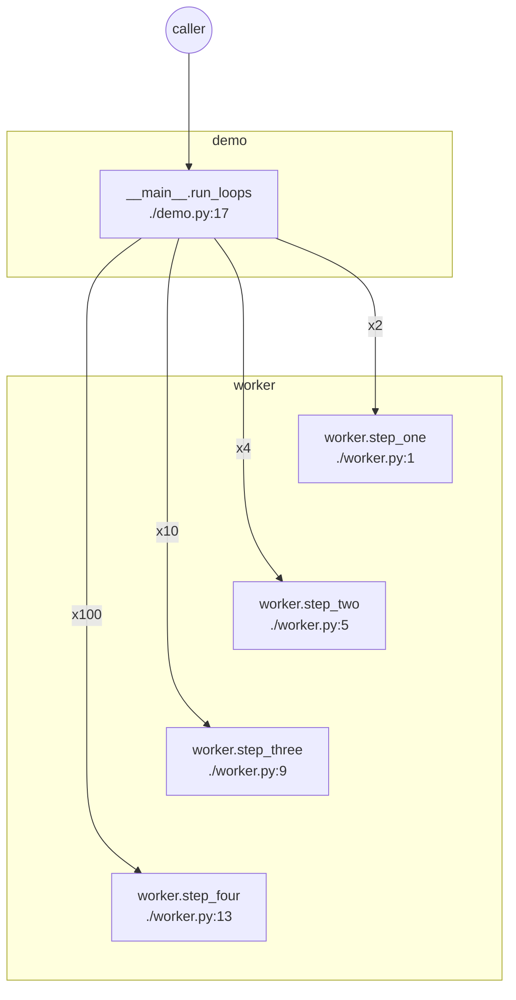

| Function | File | Input args | Return value | Internal variables (at return) |
| --- | --- | --- | --- | --- |
| __main__.run_loops | ./demo.py:17 | - | None | i=99 |
| worker.step_one | ./worker.py:1 | i=0 | 1 | - |
| worker.step_two | ./worker.py:5 | i=0 | 0 | - |
| worker.step_three | ./worker.py:9 | i=0 | 0 | - |
| worker.step_four | ./worker.py:13 | tag='alpha' | 'ALPHA' | - |
