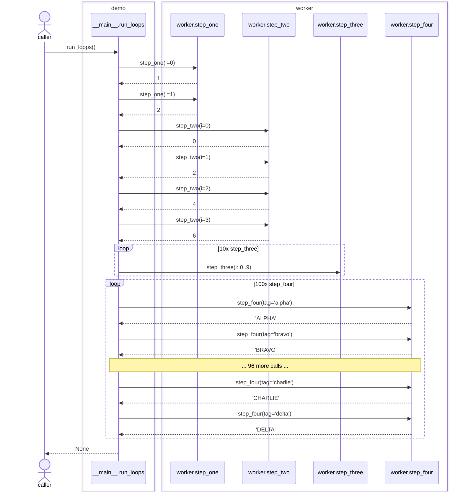

```mermaid
%%{init: {'maxTextSize': 100000}}%%
sequenceDiagram
    actor caller
    box demo
        participant __main__.run_loops as __main__.run_loops
    end
    box worker
        participant worker.step_one as worker.step_one
        participant worker.step_two as worker.step_two
        participant worker.step_three as worker.step_three
        participant worker.step_four as worker.step_four
    end
    caller->>__main__.run_loops: run_loops()
    __main__.run_loops->>worker.step_one: step_one(i=0)
    worker.step_one-->>__main__.run_loops: 1
    __main__.run_loops->>worker.step_one: step_one(i=1)
    worker.step_one-->>__main__.run_loops: 2
    __main__.run_loops->>worker.step_two: step_two(i=0)
    worker.step_two-->>__main__.run_loops: 0
    __main__.run_loops->>worker.step_two: step_two(i=1)
    worker.step_two-->>__main__.run_loops: 2
    __main__.run_loops->>worker.step_two: step_two(i=2)
    worker.step_two-->>__main__.run_loops: 4
    __main__.run_loops->>worker.step_two: step_two(i=3)
    worker.step_two-->>__main__.run_loops: 6
    loop 10x step_three
    __main__.run_loops->>worker.step_three: step_three(i: 0..9)
    end
    loop 100x step_four
    __main__.run_loops->>worker.step_four: step_four(tag='alpha')
    worker.step_four-->>__main__.run_loops: 'ALPHA'
    __main__.run_loops->>worker.step_four: step_four(tag='bravo')
    worker.step_four-->>__main__.run_loops: 'BRAVO'
    Note over __main__.run_loops,worker.step_four: ... 96 more calls ...
    __main__.run_loops->>worker.step_four: step_four(tag='charlie')
    worker.step_four-->>__main__.run_loops: 'CHARLIE'
    __main__.run_loops->>worker.step_four: step_four(tag='delta')
    worker.step_four-->>__main__.run_loops: 'DELTA'
    end
    __main__.run_loops-->>caller: None
```
