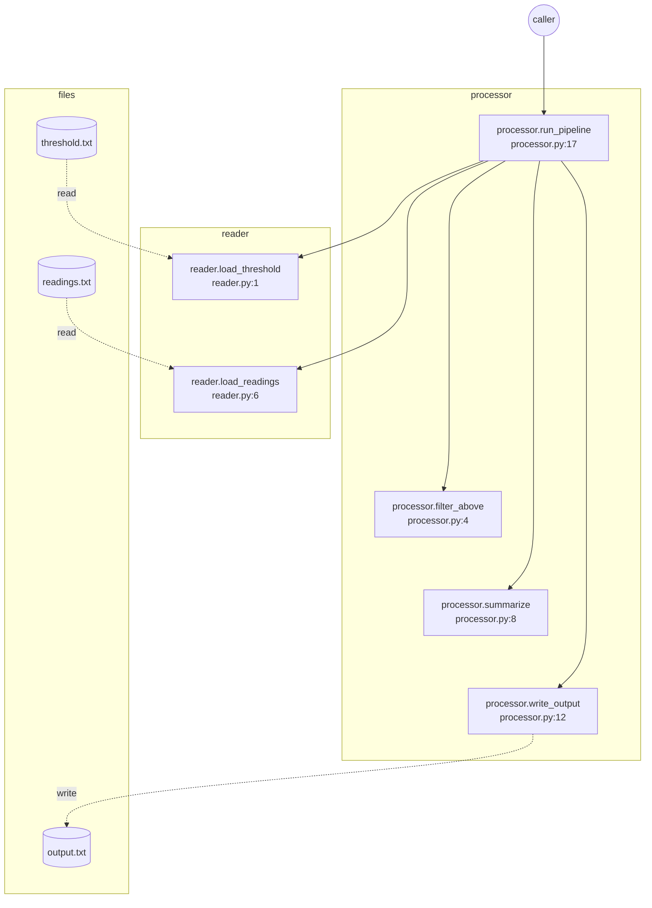

| Function | File | Input args | Return value | Internal variables (at return) |
| --- | --- | --- | --- | --- |
| processor.run_pipeline | processor.py:17 | threshold_path='threshold.txt', readings_path='readings.txt', output_… | {'count': 3, 'total': 55.0} | threshold=10.0, readings=[5.0, 12.0, 18.0, 3.0, 25.0], kept=[12.0, 18.0, 25.0], summary={'count': 3… |
| reader.load_threshold | reader.py:1 | path='threshold.txt' | 10.0 | f=<_io.TextIOWrapper name='thre… |
| reader.load_readings | reader.py:6 | path='readings.txt' | [5.0, 12.0, 18.0, 3.0, 25.0] | f=<_io.TextIOWrapper name='read… |
| processor.filter_above | processor.py:4 | readings=[5.0, 12.0, 18.0, 3.0, 25.0], threshold=10.0 | [12.0, 18.0, 25.0] | - |
| processor.summarize | processor.py:8 | readings=[12.0, 18.0, 25.0] | {'count': 3, 'total': 55.0} | - |
| processor.write_output | processor.py:12 | path='output.txt', summary={'count': 3, 'total': 55.0} | None | f=<_io.TextIOWrapper name='outp… |

**Files touched:**

| File | Mode | Direction | Called from |
| --- | --- | --- | --- |
| threshold.txt | `r` | read | reader.load_threshold |
| readings.txt | `r` | read | reader.load_readings |
| output.txt | `w` | write | processor.write_output |
