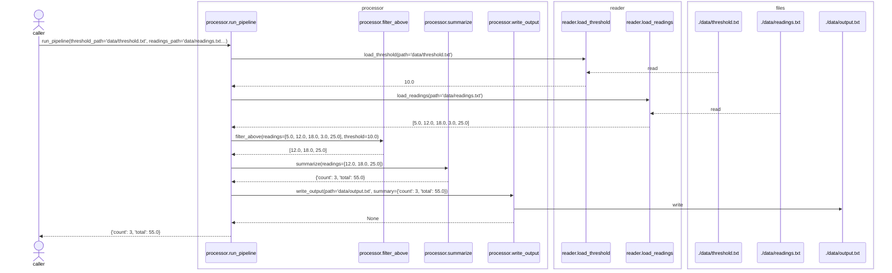

```mermaid
%%{init: {'maxTextSize': 100000}}%%
sequenceDiagram
    actor caller
    box processor
        participant processor.run_pipeline as processor.run_pipeline
        participant processor.filter_above as processor.filter_above
        participant processor.summarize as processor.summarize
        participant processor.write_output as processor.write_output
    end
    box reader
        participant reader.load_threshold as reader.load_threshold
        participant reader.load_readings as reader.load_readings
    end
    box files
        participant file0 as ./data/threshold.txt
        participant file1 as ./data/readings.txt
        participant file2 as ./data/output.txt
    end
    caller->>processor.run_pipeline: run_pipeline(threshold_path='data/threshold.txt', readings_path='data/readings.txt…)
    processor.run_pipeline->>reader.load_threshold: load_threshold(path='data/threshold.txt')
    file0-->>reader.load_threshold: read
    reader.load_threshold-->>processor.run_pipeline: 10.0
    processor.run_pipeline->>reader.load_readings: load_readings(path='data/readings.txt')
    file1-->>reader.load_readings: read
    reader.load_readings-->>processor.run_pipeline: [5.0, 12.0, 18.0, 3.0, 25.0]
    processor.run_pipeline->>processor.filter_above: filter_above(readings=[5.0, 12.0, 18.0, 3.0, 25.0], threshold=10.0)
    processor.filter_above-->>processor.run_pipeline: [12.0, 18.0, 25.0]
    processor.run_pipeline->>processor.summarize: summarize(readings=[12.0, 18.0, 25.0])
    processor.summarize-->>processor.run_pipeline: {'count': 3, 'total': 55.0}
    processor.run_pipeline->>processor.write_output: write_output(path='data/output.txt', summary={'count': 3, 'total': 55.0})
    processor.write_output->>file2: write
    processor.write_output-->>processor.run_pipeline: None
    processor.run_pipeline-->>caller: {'count': 3, 'total': 55.0}
```
