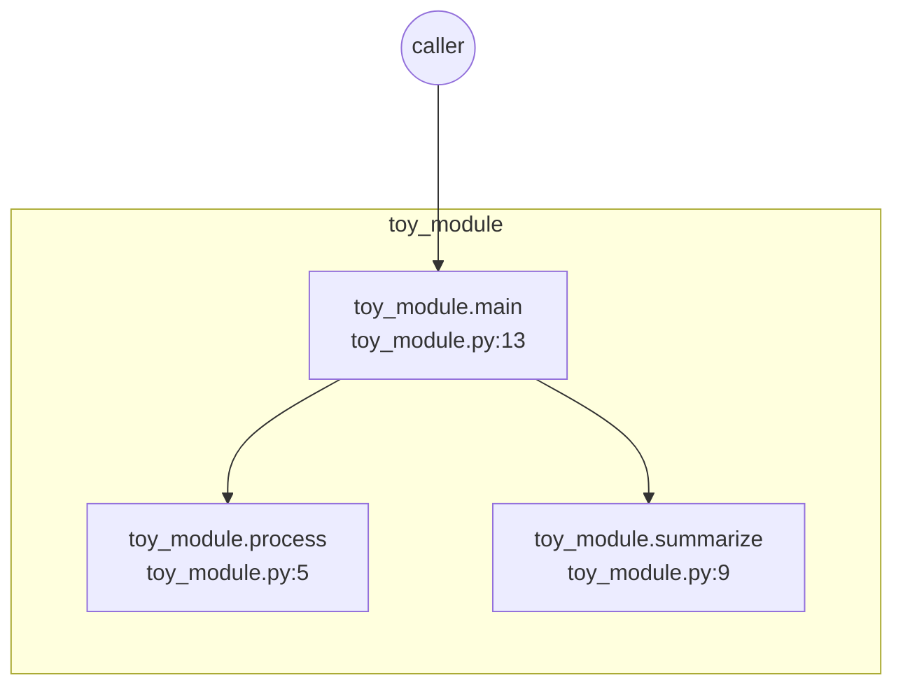

| Function | File | Input args | Return value | Internal variables (at return) |
| --- | --- | --- | --- | --- |
| toy_module.main | toy_module.py:13 | - | 12 | data={'a': 1, 'b': 2, 'c': 3}, processed={'a': 2, 'b': 4, 'c': 6} |
| toy_module.process | toy_module.py:5 | data={'a': 1, 'b': 2, 'c': 3} | {'a': 2, 'b': 4, 'c': 6} | - |
| toy_module.summarize | toy_module.py:9 | data={'a': 2, 'b': 4, 'c': 6} | 12 | - |
